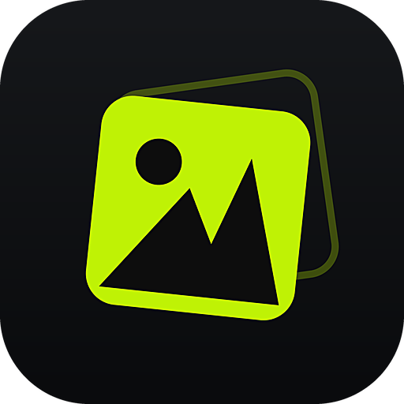
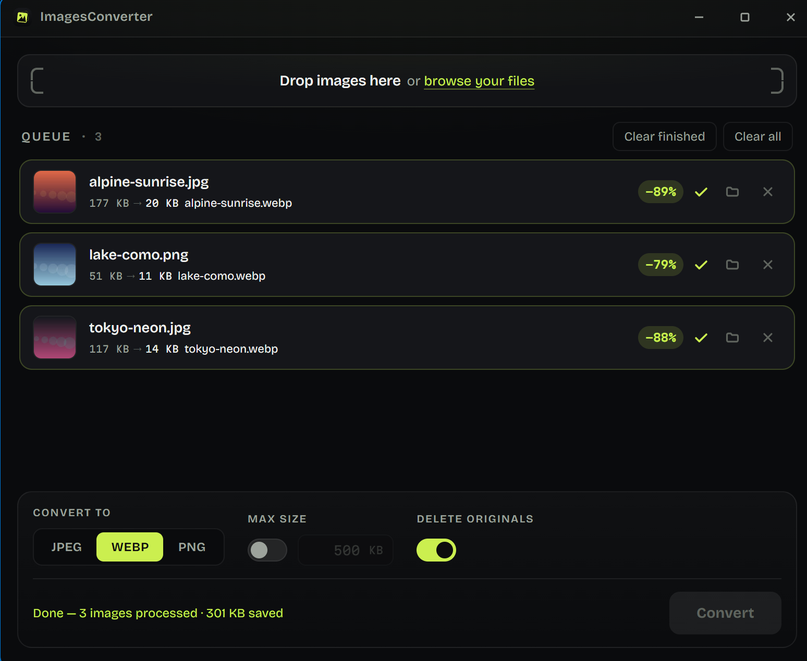

<p align="center">
  
</p>

<h1 align="center">ImagesConverter</h1>

<p align="center">
  Convert and compress your images, and clean their metadata. Everything runs locally.
</p>

<p align="center">
  
</p>

## Download

Grab the latest installer from the [Releases](https://github.com/LoicPandul/ImagesConverter/releases) page. These builds are not signed, so your OS will warn you on first launch:

| Platform | File | First launch |
|---|---|---|
| Windows | `*-setup.exe` or `.msi` | SmartScreen warns: click "More info", then "Run anyway" |
| macOS | `.dmg` | Right-click the app, then "Open" |
| Linux | `.AppImage` (portable), `.deb` or `.rpm` | Nothing special, `chmod +x` the AppImage |

## Features

- Drop files anywhere in the window, or browse, to convert JPEG, PNG, WEBP, GIF, BMP and TIFF images to JPEG, WEBP or PNG.
- Metadata is always removed: EXIF, GPS coordinates, XMP, IPTC, comments. When the file is already in the target format, the cleaning is lossless, since the app rewrites the container without re-encoding a single pixel.
- The ICC color profile is deliberately kept. It contains no personal information (it is a generic file shipped with your camera or screen), and removing it would visibly shift the colors of wide-gamut images.
- To guarantee a precise weight, give a maximum size in KB: the app searches for the best quality that fits, and only downscales as a last resort. Lossy PNG relies on built-in palette quantization, so there is no external tool to install.
- The EXIF orientation is applied before the metadata is stripped, so rotated phone photos come out upright.
- Optional background removal on your machine: an AI model (ISNet) cuts the subject out and the background becomes transparent, for WEBP and PNG targets. Off by default; the first activation downloads the model and its runtime once (~250 MB, checksum-verified), then it runs fully offline. Images never leave your computer.
- Every file is processed on its own CPU core.
- Existing files are never overwritten (a numbered suffix is added instead), and an original is only deleted once its replacement is fully written.
- Native on Windows, macOS and Linux: a few MB, instant startup. The app never touches the network, with one exception: the explicit background-removal download above.

## Verify your download

Each release ships a `SHA256SUMS` manifest signed with the author's [minisign](https://jedisct1.github.io/minisign/) key. The public key is:

```
RWTz3c4gUmglCX5Uvjthigz1ts3TS3ZSdhRNpFgOJRW/Wr4XjGlqTR3O
```

Download `SHA256SUMS` and `SHA256SUMS.minisig` into the same folder as your installer, then run the two checks for your platform: the signature proves the hash list comes from the author, the hash proves your file was not altered.

### Windows (PowerShell)

Get `minisign.exe` from the [official releases](https://github.com/jedisct1/minisign/releases) (win64 zip, `x86_64` folder).

```powershell
minisign -Vm SHA256SUMS -P RWTz3c4gUmglCX5Uvjthigz1ts3TS3ZSdhRNpFgOJRW/Wr4XjGlqTR3O

$file = "ImagesConverter_2.1.0_x64-setup.exe"   # the file you downloaded
$hash = (Get-FileHash $file).Hash.ToLower()
if (Select-String -Quiet -SimpleMatch "$hash  $file" SHA256SUMS) { "OK: $file matches" } else { "MISMATCH - do not run this file" }
```

### macOS

```sh
brew install minisign
minisign -Vm SHA256SUMS -P RWTz3c4gUmglCX5Uvjthigz1ts3TS3ZSdhRNpFgOJRW/Wr4XjGlqTR3O
shasum -a 256 --check SHA256SUMS --ignore-missing
```

### Linux

```sh
sudo apt install minisign   # or your distribution's equivalent
minisign -Vm SHA256SUMS -P RWTz3c4gUmglCX5Uvjthigz1ts3TS3ZSdhRNpFgOJRW/Wr4XjGlqTR3O
sha256sum --check SHA256SUMS --ignore-missing
```

## Build from source

Requires [Rust](https://rustup.rs/).

```sh
cd src-tauri
cargo run              # development
cargo build --release  # target/release/imagesconverter
```

The frontend (`ui/`) is plain HTML, CSS and JavaScript: no Node, no build step.

## License

Released into the public domain under the [Unlicense](LICENSE).
